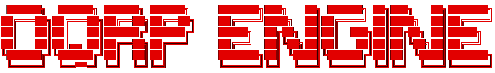

#

# The OQRP Engine Documentation
---
This is a documentation of The OQRP Engine and its capabilites, including instructions for its installation and usage and information on its modules, as well as some development principles and guidelines for creating games in this environment.

Layout for this documentation was inspired by the official [GameMaker Docs](https://manual.gamemaker.io/). Use the left navigation menu to browse categories and articles, or use the search bar on the top right.

For new users, it is highly recommended to read the Introduction, Overview, Quick Start/Setup and Development Principles pages. Please note that there may be aspects of the engine that are not in this documentation by being obscured intentionally for security reasons, or to protect otherwise proprietary code.

If you find any problems or inconsistencies, please contact us through our official channels.